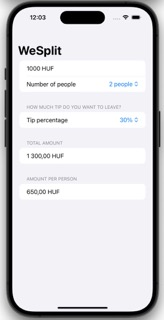
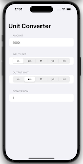
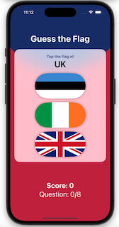

# 100 Days of SwiftUI

Solutions to Paul Hudson's "100 days of SwiftUI" projects and challenges.

https://www.hackingwithswift.com/100/swiftui

## Preview

*Within each project are larger versions of the screenshots.*

Projects / Topics                                                                                                                                                            | Screenshots
---                                                                                                                                                                          |---
[Project 1](WeSplit) - *WeSplit*  (with challenges)                                           Form, Section, NavigationView, @State property wrapper, TextField, Picker, ForEach  |  |
[Challenge Day 1](UnitConverter) - *Unit Converter*  |   |
[Project 2](GuessTheFlag) - *Guess the Flag*  (with challenges)                                           VStack, Image, LinearGradient, Alert  |  |
